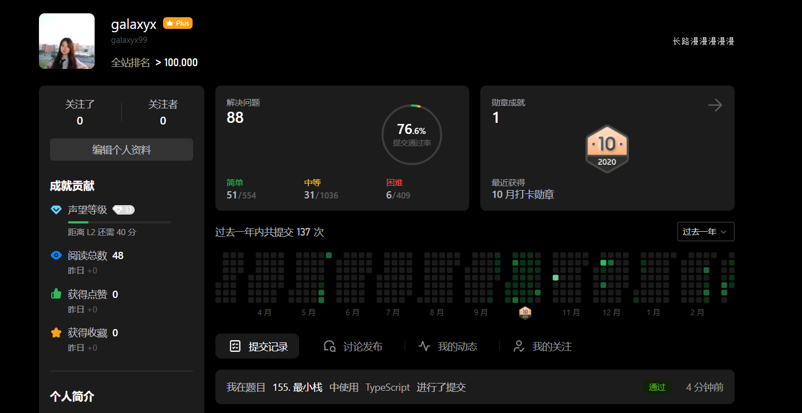

# 155 Min Stack




## Description

Design a stack that supports push, pop, top, and retrieving the minimum element in constant time.

- push(x) -- Push element x onto stack.
- pop() -- Removes the element on top of the stack.
- top() -- Get the top element.
- getMin() -- Retrieve the minimum element in the stack.

## Example

### Input

["MinStack","push","push","push","getMin","pop","top","getMin"]
[[],[-2],[0],[-3],[],[],[],[]]

### Output

[null,null,null,null,-3,null,0,-2]

## Solution

Main: Based on **Array** and a **single value** to save minimum

Tips:

- TypeScript is a good choice for this problem owing to its strict limitation on data type.
- To refresh the minimum , we need to update the min when `push` and `pop`
- I was lazy on getting minimum in pop function. It just calls library function.

## Code

```typescript
class MinStack {

    stack: Array<number>
    min: number

    constructor(){
        this.stack = []
        this.min = Infinity
    }

    push(x: number): void{
        this.stack.push(x)
        if(x < this.min) this.min = x;
    }

    pop(): void{
        this.stack.pop()
        this.min = Math.min(...this.stack)
    }

    top(): number {
        return this.stack[this.stack.length - 1];
    }

    getMin(): number{
        return this.min;
    }

}

```

