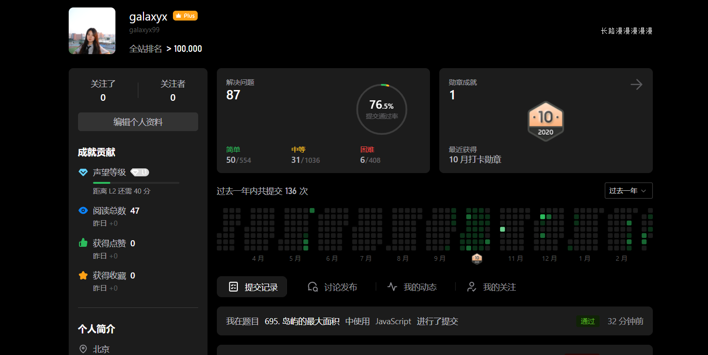

# 695 Max Area of Island

---




## Description

Given a non-empty 2D array grid of 0's and 1's, an island is a group of 1's (representing land) connected 4-directionally (horizontal or vertical.) You may assume all four edges of the grid are surrounded by water.

Find the maximum area of an island in the given 2D array. (If there is no island, the maximum area is 0.)

## Example

### Input

[[0,0,1,0,0,0,0,1,0,0,0,0,0],
 [0,0,0,0,0,0,0,1,1,1,0,0,0],
 [0,1,1,0,1,0,0,0,0,0,0,0,0],
 [0,1,0,0,1,1,0,0,1,0,1,0,0],
 [0,1,0,0,1,1,0,0,1,1,1,0,0],
 [0,0,0,0,0,0,0,0,0,0,1,0,0],
 [0,0,0,0,0,0,0,1,1,1,0,0,0],
 [0,0,0,0,0,0,0,1,1,0,0,0,0]]

### Output

6

## Solution

Main : **Deep First Search + Recursion**

Tips:

- set the node traversed disabled
- take the four aspects of the current node into consideration (not only the right and bottom)

Mistake I got:

- I tried to extract the variable 'count' into the global and make it self-increasing in dfs function, but the DOM doesn't work in leetcode's online IDE.  And just defining them as  global variables is wrong, because  the scope of the variable is just inside the function. 
- Besides, this problem reminded me of the **map** that degree are 4.

```js
var dfs = function (grid,i,j){
    if(!grid[i] || !grid[i][j] || grid[i][j] == 0) {
        return 0;
    }
    grid[i][j]=0;   //important!
    let count = 1;
    count += dfs(grid, i+1 ,j);
    count += dfs(grid, i ,j+1);
    count += dfs(grid, i-1 ,j);
    count += dfs(grid, i ,j-1);
    return count;
}

var maxAreaOfIsland = function(grid) {
    var r = 0, c = 0;
    var cur = 0;
    var max = 0;

    for(let i = r; i < grid.length; i++){
        for(let j = c; j < grid[i].length; j++){
            if(grid[i][j] == 1) {
                max = Math.max(max, dfs(grid,i,j));
            }
        }
    }
    return max;
};
```

